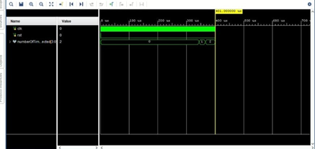

# 🔬 Pattern Detection Using CNN — RTL Hardware Implementation

> *A hardware-efficient Convolutional Neural Network implemented at Register Transfer Level (RTL) in Verilog HDL, enabling real-time object recognition on FPGA platforms.*

---

## Abstract

Modern edge AI demands inference engines that are **fast, deterministic, and power-conscious** — constraints that software CNNs running on CPUs or GPUs frequently fail to meet. This work presents a fully synchronous, pipelined CNN architecture synthesized in Verilog HDL, designed to detect and count occurrences of a predefined **8×8 test pattern** within a **128×128 grayscale image**.

The pipeline integrates Laplacian edge enhancement, pattern-matching convolution, max pooling, and threshold-based detection — validated through RTL simulation and confirmed operable at **155.67 MHz**, making it a compelling candidate for FPGA-based embedded vision systems.

---

## Motivation

> *"Why hardware, when software works?"*

Software CNNs offer flexibility, but at the cost of latency, power, and unpredictability. RTL-level design trades generality for precision — delivering:

- ⚡ **Deterministic, cycle-accurate latency**
- 🔋 **Minimal power footprint for edge deployment**
- 🚀 **True parallel execution — not simulated parallelism**

This project bridges the gap between algorithmic CNN theory and physical silicon-level execution, demonstrating that even constrained hardware can perform meaningful visual intelligence.

---

## System Specifications

| Parameter | Specification |
|---|---|
| Input Image | 128 × 128 pixels (Grayscale) |
| Test Pattern | 8 × 8 pixels |
| Pixel Precision | 8-bit unsigned |
| Output | Count of detected pattern matches |

---

## CNN Processing Pipeline

The system follows a four-stage processing cascade, each stage implemented as a dedicated RTL module with pipeline registers at boundaries:

```
  [Input Image 128×128]
          │
          ▼
  ┌───────────────────┐
  │  Stage 1          │  Laplacian 3×3 Convolution
  │  Edge Enhancement │  → Image: 126×126 | Pattern: 6×6
  └────────┬──────────┘
           │
           ▼
  ┌───────────────────┐
  │  Stage 2          │  Pattern-Matching Convolution (6×6)
  │  Feature Mapping  │  → Feature Map: 121×121
  └────────┬──────────┘
           │
           ▼
  ┌───────────────────┐
  │  Stage 3          │  2×2 Max Pooling
  │  Spatial Reduction│  → Pooled Map: 60×60
  └────────┬──────────┘
           │
           ▼
  ┌───────────────────┐
  │  Stage 4          │  Threshold @ 25% of Self-Convolution
  │  Detection & Count│  → Match Count Output
  └───────────────────┘
```

---

## Architecture Deep Dive

### Stage 1 — Laplacian Convolution (Edge Enhancement)

A 3×3 Laplacian kernel is independently applied to both the input image and the test pattern, sharpening edges and suppressing uniform regions. This step is critical — raw pixel matching is noise-sensitive; **edge-space matching is structurally robust**.

- Image output: **126 × 126**
- Pattern output: **6 × 6**

<p align="center">
  <br>
  <i>Fig. 1 — RTL Architecture of Laplacian Convolution</i>
</p>

---

### Stage 2 — Pattern Matching Convolution

The Laplacian-processed image is convolved with the 6×6 processed pattern kernel. A **parallel multiplier array** feeds a **hierarchical adder tree**, maximizing throughput with minimal logic depth.

- Output feature map: **121 × 121**
- Fully pipelined for sustained single-cycle-per-window throughput

<p align="center">
  <br>
  <i>Fig. 2 — Pattern Matching Convolution Architecture</i>
</p>

---

### Stage 3 — Max Pooling

A 2×2 max pooling layer performs spatial downsampling, suppressing weak activations and retaining dominant pattern responses.

- Output: **60 × 60**
- Implemented as a one-cycle comparator per pooling window

<p align="center">
  <br>
  <i>Fig. 3 — Max Pooling RTL Architecture</i>
</p>

---

### Stage 4 — Thresholding & Detection

Each pooled activation is compared against a threshold derived as **25% of the pattern's self-convolution score** — a normalized, input-adaptive criterion. Activations exceeding this threshold register as confirmed matches, and a running counter accumulates the final detection count.

---

## Hardware Implementation

### Design Philosophy

This design is built around three RTL principles:

**Pipelining** — Each convolution stage is broken into sub-stages with registered boundaries, maximizing clock frequency without stalling the datapath.

**Parallelism** — All multiplications within a convolution window execute simultaneously; the hierarchical adder tree compresses 36 partial products in O(log n) levels.

**Bit-Width Optimization** — Arithmetic is performed at 16–22 bits, carefully selected to prevent overflow while avoiding costly 32-bit operations.

### Toolchain

| Tool | Purpose |
|---|---|
| Verilog HDL | RTL Design |
| Xilinx Vivado | Simulation, Synthesis, Timing Analysis |
| RTL Simulation | Functional Verification |

---

## Results

| Metric | Value |
|---|---|
| Maximum Clock Frequency | **155.67 MHz** |
| Total Latency | ~37,722 clock cycles |
| Pooling Output Dimensions | 60 × 60 |
| Detection Accuracy | Verified via RTL simulation |

<p align="center">
  <br>
  <i>Fig. 4 — Timing Diagram of CNN Top Module</i>
</p>

At 155.67 MHz, the design processes one image in approximately **242 µs** — well within the real-time threshold for most embedded vision tasks.

---

## Applications

This architecture is directly applicable to:

- **FPGA-based vision accelerators** — autonomous vehicles, drones, industrial inspection
- **Embedded AI systems** — smart cameras, IoT endpoints
- **Robotics** — real-time object localization and tracking
- **Surveillance** — low-power, always-on scene monitoring
- **Medical Imaging** — preprocessing pipelines for anomaly detection

---

## Future Work

| Enhancement | Impact |
|---|---|
| Multi-pattern detection support | Extend utility to complex scene understanding |
| AXI-stream interface | Enable SoC integration with ARM processors |
| FPGA deployment on Zynq-7000 | Full end-to-end hardware validation |
| Power & area optimization | Reduce resource footprint for resource-constrained FPGAs |
| Noise-robust preprocessing | Improve reliability under real-world imaging conditions |

---

## Authors

**Lankalapalli Madhan** · Bhavanam Naga Varshitha · Koram Rupalakshmi

**Supervisor:** Mr. K. Shivalal  
Department of Electronics and Communication Engineering  
**RGUKT Nuzvid**

---

<p align="center">
  <i>Built at the intersection of digital design and machine intelligence.</i>
</p>
