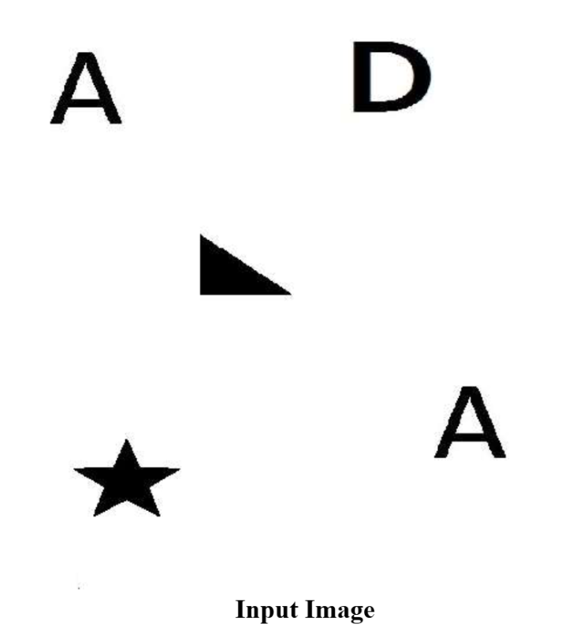
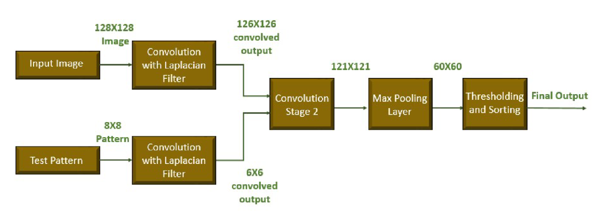
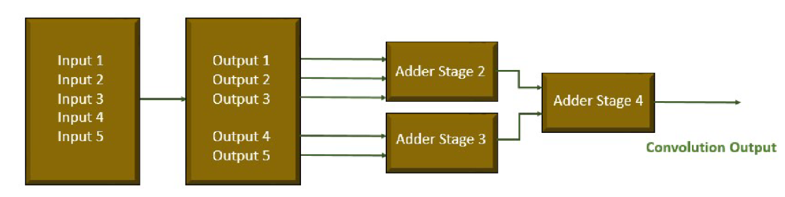
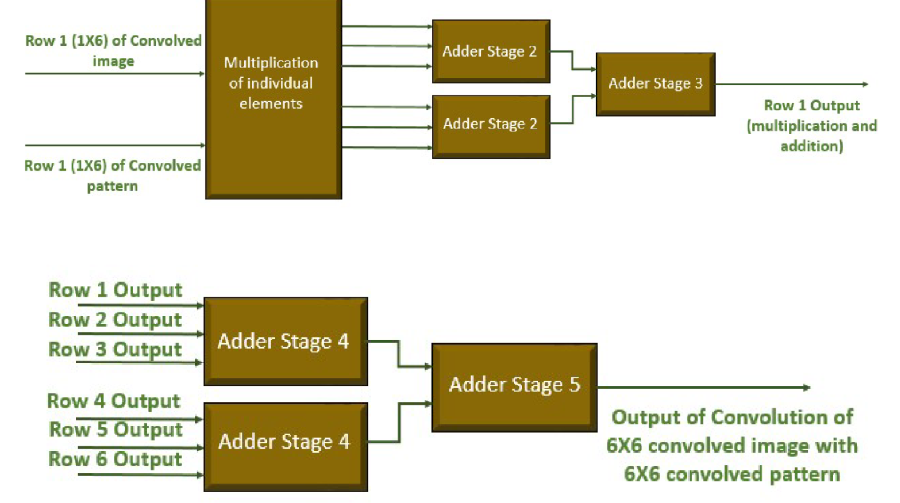
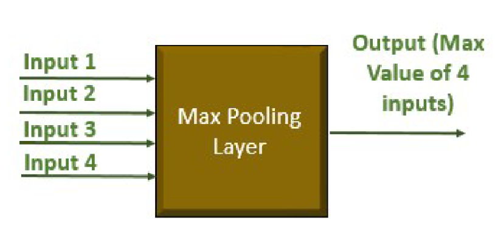

# Pattern-Detection-using-CNN
## Abstract

This project presents a **hardware-efficient Convolutional Neural Network (CNN)** implemented entirely at **Register Transfer Level (RTL)** using **Verilog HDL** for real-time object recognition. The system detects and counts occurrences of a predefined **8×8 test pattern** within a **128×128 grayscale image**.  

The proposed CNN architecture employs **Laplacian-based edge enhancement**, **pattern-matching convolution**, **max pooling**, and **threshold-based detection**, optimized using pipelining and parallelism. RTL simulations validate functional correctness, and timing analysis confirms reliable operation at **155.67 MHz**, making the design suitable for **FPGA-based edge AI applications**.

## Keywords
CNN, Verilog HDL, RTL Design, FPGA, Object Recognition, Hardware Accelerator.

## Introduction
Object recognition plays a critical role in applications such as **embedded vision, robotics, surveillance, and medical imaging**. While software CNNs offer high accuracy, they often suffer from high latency and power consumption.

This project focuses on designing a **lightweight, deterministic, and hardware-optimized CNN** using Verilog HDL, emphasizing:
- Parallel computation  
- Pipelined data paths  
- Predictable timing and low latency  

## System Specifications

### Input Parameters
- **Input Image Size:** 128 × 128 (Grayscale)
- **Test Pattern Size:** 8 × 8
- **Pixel Precision:** 8-bit

### Output
- Number of detected pattern matches in the input image

  

  <b>Fig. 1. Input Image</b>

  

  <b>Fig. 2. Test Image</b>

## CNN Processing Pipeline

  

  <b>Fig. 3. CNN Processing Flow Diagram</b>

The CNN consists of the following stages:
1. Laplacian Convolution (Edge Enhancement)  
2. Pattern Matching Convolution  
3. Max Pooling  
4. Thresholding and Pattern Counting  

---

## Proposed Architecture

### 4.1 Laplacian Convolution (Stage 1)
- 3×3 Laplacian filter applied to both input image and test pattern  
- Enhances edges and salient features  
- Output Sizes:
  - Image: 126 × 126  
  - Pattern: 6 × 6  
  

  

  <b>Fig. 4. RTL Architecture of Laplacian Convolution</b>

  

  <b>Fig. 5. Pattern Matching Convolution Architecture</b>

  

  <b>Fig. 6. Max Pooling RTL Architecture</b>

### 4.4 Thresholding and Detection
- Threshold set to **25% of pattern self-convolution value**  
- Simple comparator-based detection  
- Counts valid detections across pooled feature map  

## Hardware Implementation

### Design Characteristics
- Fully synchronous RTL design  
- Pipelined convolution stages  
- Optimized bit-width arithmetic (16–22 bits)  
- Deterministic latency  

### Tools Used
- **HDL:** Verilog  
- **Simulation & Synthesis:** Xilinx Vivado  
- **Verification:** RTL Simulation  

  
**Fig. 6. Top-Level CNN RTL Block Diagram**

---

## Results and Performance

| Parameter | Value |
|---------|------|
| Maximum Clock Frequency | **155.67 MHz** |
| Total Latency | ~37,722 clock cycles |
| Pooling Output Size | 60 × 60 |
| Detection Accuracy | Verified via RTL simulation |

  

  <b>Fig. 8. Timing Diagram of CNN Top Module</b>

##  Applications
- FPGA-based vision accelerators  
- Embedded AI systems  
- Robotics and automation  
- Surveillance systems  
- Medical image preprocessing  

## Future Enhancements
- Multi-pattern detection support  
- AXI-stream interface integration  
- FPGA deployment on Zynq-7000  
- Power and area optimization  
- Robust preprocessing for noisy inputs  

## Authors
- **Lankalapalli Madhan**  
- Bhavanam Naga Varshitha  
- Koramalakshmi Rupalakshmi  

**Supervisor:** Mr. K. Shivalal  
Department of Electronics and Communication Engineering  
RGUKT Nuzvid
